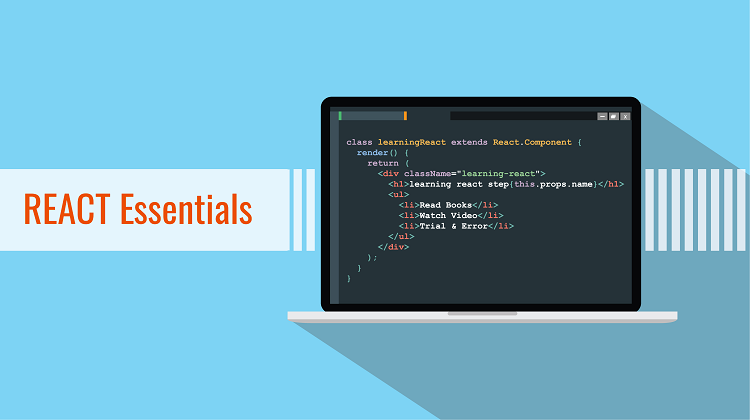

# React Essentials

A collection of must-have extensions for React developers.

## Extensions Included

* [ES7 React/Redux/GraphQL/React-Native snippets](https://marketplace.visualstudio.com/items?itemName=dsznajder.es7-react-js-snippets) by dsznajder
Simple extensions for React, Redux and Graphql in JS/TS with ES7 syntax

* [colorize](https://marketplace.visualstudio.com/items?itemName=kamikillerto.vscode-colorize) by kamikillerto: help visualize css colors in files.

* [Prettier - Code formatter](https://marketplace.visualstudio.com/items?itemName=esbenp.prettier-vscode) by Esben Petersen: Code formatter using prettier.

 * [ESLint](https://marketplace.visualstudio.com/items?itemName=dbaeumer.vscode-eslint) by Dirk Baeumer : Integrates ESLint JavaScript into VS Code.

 * [exports autocomplete](https://marketplace.visualstudio.com/items?itemName=capaj.vscode-exports-autocomplete) by capaj : autocompletes javascript module exports from your project.

 * [React Pure To Class](https://marketplace.visualstudio.com/items?itemName=angryobject.react-pure-to-class-vscode) by Max Shishkin : Convert pure react components to class components

 * [Settings Sync](https://marketplace.visualstudio.com/items?itemName=Shan.code-settings-sync) by Shan Khan : Synchronize Settings, Snippets, Themes, File Icons, Launch, Keybindings, Workspaces and Extensions Across Multiple Machines Using GitHub Gist.

 * [npm Intellisense](https://marketplace.visualstudio.com/items?itemName=christian-kohler.npm-intellisense) by Christian Kohler: autocompletes npm modules in import statements

 * [Path Intellisense](https://marketplace.visualstudio.com/items?itemName=christian-kohler.path-intellisense) by Christian Kohler: autocompletes filenames

 * [Code Spell Checker](https://marketplace.visualstudio.com/items?itemName=streetsidesoftware.code-spell-checker) by Street Side Software : Spelling checker for source code

